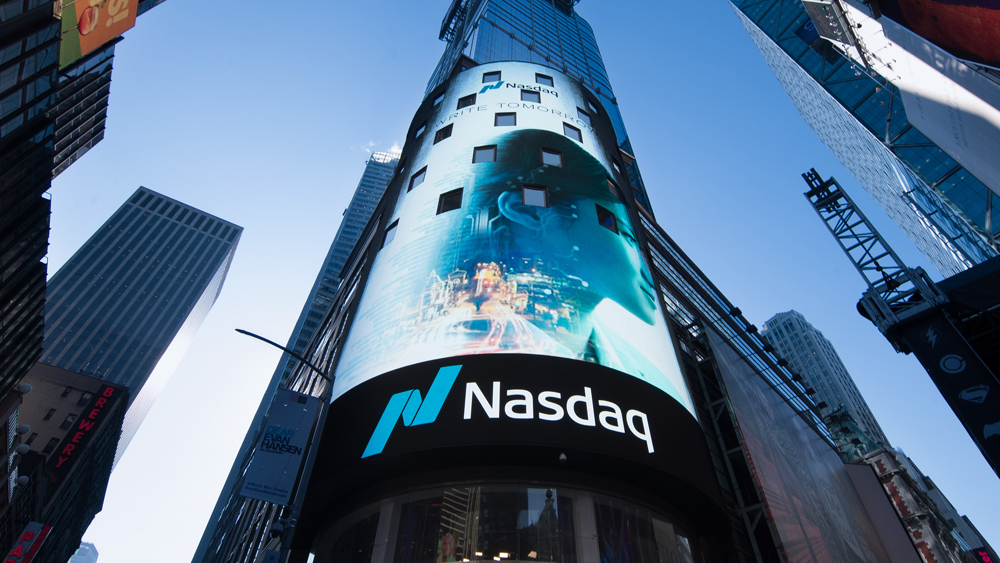

# Nasdaq Stock Market Case Study 2023
> 

## The Evolution of Nasdaq as a Fintech Company from the 1971 to 2023
### *Regulation Technology (Regtech)*

## Genesis and Growth
```python
```
> 

Nasdaq ("The Company") is one of the largest stock exchanges in the world headquartered in New York.  
Nasdaq stands for  National Association of Securities Dealers Automated Quotations and it was founded in 1971. 
Nasdaq's initial purpose was to automate the market for securities that were not listed on an exchange at that time. The company was founded by the Securities Dealers Association and the Financial Security Regulatory Industry (FINRA). Back then, traders had to physically be on the counter to be able to trade securities. In the late 1960’s, the US economy rapidly grew, the GDP growth averaged about 5% and wages were growing at an exponential rate. As the average American became confident with the growth, they started to heavily invest in the stock market. As a result, the market had a hard time keeping up with the daily volume of transactions. In order to keep up with the demand, Nasdaq was created in 1971. Before the Company became the large stock exchange as know today, it started as an electronic quotation service that allowed investors to electronically see live prices of various stocks. The electronic execution of trades came shortly after Nasdaq was officially launched. From there, the company grew rapidly to the point that in the mid 80’s it accounted for almost 50% of the US securities market. Sebsequently, Nasdaq was redefined as a stock exchange and tech company. Since the redefinition,tech giants such as Microsoft, Apple and Intel decided be listed on Nasdaq earning itself the repution of the main exchange for the tech companies. The Company continued to grow by acquiring multiple stock exchanges throughout the world and in 1998, it became the first company to offer online trading. Unlike its early days, the Company has multiple sources of income such as its index funds, its Regulatory Business, its tech and product development business, its online Trading Business and various other businesses.

## Current Issues

As described earlier, Nasdaq was able to change the landscape of investments by incorporating the use of technology. Today one of the main issues the Company is facing, is the rapid raise of ciber criminality and fraud. In order to mitigate these risks, Nasdaq is constently enforcing its regulatory system with the use of Artificial Intelligence and various other technoligies. Companies are listed on Nasdaq are required to submit their public and non public data. As a result, Nasdaq is responsible for guaranteeing the safety of listed companies’ data. To further enforce and mitigate risks and for regulatory purposes, on June 12, 2023, Nasdaq acquired Adenza Group Inc (Adenza) for $10 billion.

## Problem Solving and Competitive Advantage
> 

Adenza is a Software  provider specialized in capital markets, investments  management, central banking, risk management, regulatory compliance solutions, treasury and  liquidity. Their integrated suite of trading and risk applications are used by banks and other financial institutions to consolidate and streamline their operations. The Main competitors of Nasdaq are New York Stock Exchange (NYSE) and London Stock Exchange (LSE). The advantage Nasdaq has over its competitors is the fact that it is able to take advantage of new technologies earlier since it mainly lists tech companies. In addition, Nasdaq has lower listing fees which allows startups, to be listed as long as they are compliant with Security Exchange Commission (SEC) and the Nasdaq rules. By allowing startups to be listed in the market does not only help these companies to raise money and grow, it also benefits nasdaq because it allows them to stay on top of new technologies in real time. In 2022, Nasdaq generated about $6 billion in revenues which is about 6% higher than 2021 and 10% higher than 2020. About 57% of these revenues was generated from its tech business such as Nasdaq 100 or Invesco QQQ.

## Recommendations 

Nasdaq has shown over time that it’s a successful company that is able to adapt to various economic situations and changes in the market place. Although Nasdaq has been heavily implicated in the future of the fintech industry, I would recommend a change of pace regarding the way in which they are currently working on their alternatives securities. The landscape of finance is rapidly changing, and the digitalisation of currency might take over anytime. Although, Nasdaq is already on top of these changes, implementing them faster would result in a competitive advantage. Many exchanges were reluctant to embrace Crypto currency and ETFs at first and Nasdaq was among the first to embarrass it. Although Nasddaq embraced these changes quickly,  they have yet to be implemented effectively.


To sum up, Nasdaq is one of the piomer of the Finthech Insdustry. Although they are not moving fast enough in implementing newer alternative securities, The Company has historically shown the ability to adapt and thrive in changing environments. Based on The Company's experience and history, it is probably looking at different aspects of the business from an insider perspective that the general public has yet to perceive. Nasdaq is a company everyone should continue to keep an eye on moving forward.

## Bibliography


* [https://www.nasdaq.com/market-activity/stocks/ndaq/financials](https://www.nasdaq.com/market-activity/stocks/ndaq/financials)

* [https://www.investopedia.com/ask/answers/062215/what-are-advantages-and-disadv
antages-listing-nasdaq-versus-other-stock-exchanges.asp](https://www.investopedia.com/ask/answers/062215/what-are-advantages-and-disadvantages-listing-nasdaq-versus-other-stock-exchanges.asp)

* [https://www.bloomberg.com/news/articles/2023-11-01/nasdaq-closes-10-5-billion-adenza-deal-in-bet-on-fintech-future#xj4y7vzkg](https://www.bloomberg.com/news/articles/2023-11-01/nasdaq-closes-10-5-billion-adenza-deal-in-bet-on-fintech-future#xj4y7vzkg)

 * [https://www.moneycontrol.com/news/business/markets/nasdaq-100-adds-700-billion-in-value-as-us-inflation-eases-9493151.html](https://www.moneycontrol.com/news/business/markets/nasdaq-100-adds-700-billion-in-value-as-us-inflation-eases-9493151.html)

 * [https://www.forbes.com/advisor/investing/nasdaq-stock-exchange/](https://www.forbes.com/advisor/investing/nasdaq-stock-exchange/)
